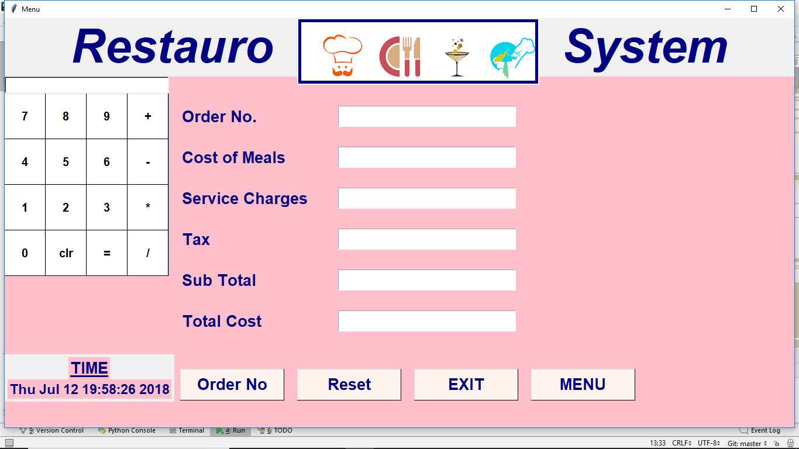

# Restaurant_manage_system
## In this system, user can easily calculate total bill of the customer. The total bill is calculated including service charges. 
## Getting Started,These instructions will get you a copy of the project up and running on your local machine for development and testing purposes.See deployment for notes on how to deploy the project on a live system.
## Prerequisites : What things you need to install the software and how to install them,Before you start Make sure that the following  prerequisites are met:
### You are working with PyCharm CE or Professional .You have installed Python itself. If you’re using macOS or Linux, your computer already has Python installed. You can get Python from python.org.
### To run this code you will need interpreter and create virtual envirenment.Configuring Python Interpreter
## Introduction 
### In PyCharm you are not limited to using just any single Python interpreter. You are able to implement several and in doing so choose  ### which interpreter you wish to use for any specific project.PyCharm supports Standard Python interpreters 

# Configure Python virtual environment
### PyCharm makes it possible to create a virtual environment using the virtualenv tool.when to install the python interpreter and create a virtual envirment ,Let’s start our project: 
# Restaurant Management System.
## dear user firstly when you open the restauro system it will show the window like:
# Restauro system

# Step 1. Go to menu to select the food/meal,select the particular foot item.

# Step 2. click on reset to clear the previous amount,in case in run the system previously.

# Step 3. Fill the food entry.

# Step 4. Click on Total in order to calculate the meal cost.

# Here you can calculate the meal cost total cost and reset the system to calaculate other cost meal

## Acknowledgments
### i would like to thanks !my instructor Aishwary Holkar,Mukesh Dubey,Rahul chaudhary,for giving guidence,Inspiration.
